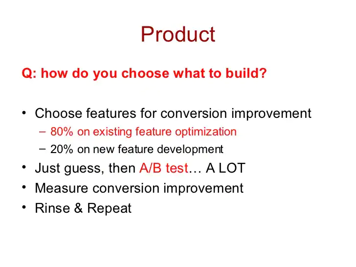

# The AARRR Framework

**Acquisition** - metrics for acquiring your user

**Activation** - metrics that show that the customer is now activated, they signed up and engaged with the app

**Retention** - customers come back to use your app

**Referral** - are users happy enough with your app that they refer it to others?

**Revenue** - metrics that show you are making revenue from your users

source - [original post of the framework](https://500hats.typepad.com/500blogs/2007/09/startup-metrics.html)

